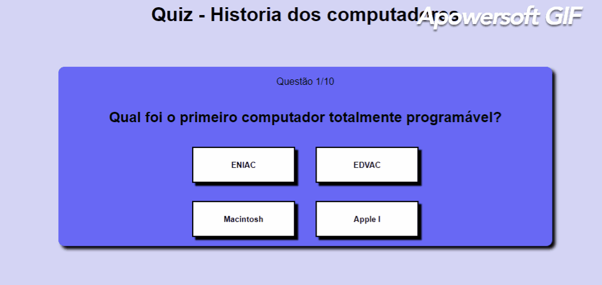

<h1 align='center'>
    Quiz - História dos Computadores
</h1>

<h2>
    
</h2>

# 📝 Sobre

O projeto **Quiz - História dos Computadores** é um site no qual 
se passa um quiz que você deve responder algumas perguntas clicando nos botões, no qual irá aparecer outro botão para ir pra próxima pergunta. Ao finalizar 10 questões, você irá receber quantas questões acertou. Desenvolvido com o intuito de mostrar um pouco sobre a grande história dos computadores.

## 💻Tecnologias utilizadas

- [HTML5](https://developer.mozilla.org/pt-BR/docs/Web/HTML/HTML5)
- [CSS3](https://www.w3.org/Style/CSS/Overview.en.html)
- [JavaScript](https://www.javascript.com/)

## ▶ Como acessar

Acesse o site: https://gabrielduete.github.io/quiz/

